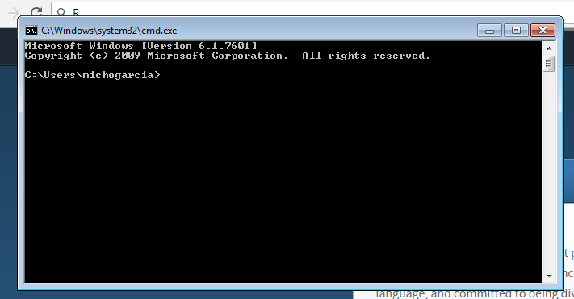
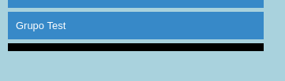
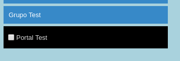
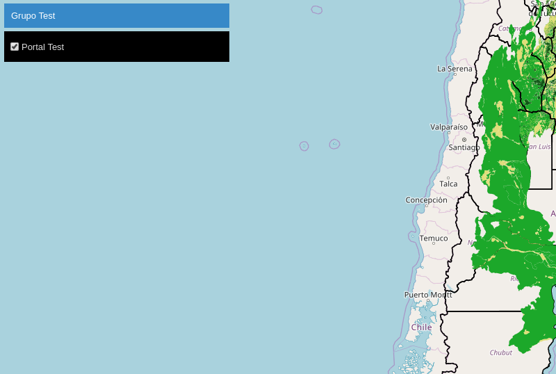

# Manual Admin Tools

## Introducción
Admin Tools ha sido adaptado desde su primera versión para obtener una herramienta de consola que nos permita el manejo del archivo `layers.json` de nuestro portal de una manera más sencilla que la modificación directa del JSON.

Mediante el uso de esta herramienta, podremos realizar tareas como:

* Obtener información acerca del arbol de capas y de cualquiera de sus elementos
* Añadir grupos, portal-layers y map-layers
* Modificar cualquiera de los parámetros de las mismas
* Eliminar los elementos

## Requisitos
Instrucciones para usar la herramienta en los diferentes sistemas operativos.

### Linux
Desde la terminal:

`$ pip install nfms4redd-cli`

Para comprobar si se ha realizado la instalación correctamente:

`$ portal --help`

lo cual deberá mostrar el siguiente mensaje:

```bash
usage: portal [-h] {groups,portal-layers,map-layers,tree} ...

Línea de comandos para manejar el fichero layers.json

optional arguments:
  -h, --help            show this help message and exit

Comandos:
  {groups,portal-layers,map-layers,tree}
    groups              Maneja los grupos del fichero layers.json
    portal-layers       portal-layers del fichero layers.json
    map-layers          Maneja las wmsLayers del fichero layers.json
    tree                Muestra el árbol de capas y el orden de dibujado
```

### Windows
Lo primero deberemos comprobar que tenemos instalado `Python` para poder ejecutar la herramienta. Para ello abrimos la consola (*Tecla Windows + E*), escribimos `cmd` y pulsamos *Intro*. Aparecerá la consola:



Escribiremos:

`C:\>python`

Si obtenemos el siguiente mensaje:

> ‘python’ is not recognized as an internal or external command

es que no tenemos Python instalado en el equipo. Para la instalación de Python en Windows existen multitud de tutoriales en la web. Desde la misma web de Python podremos descargar el ejecutable de su última versión 3.X y realizar la instalación en nuestro equipo.

Una vez que tengamos instalado Python desde la consola realizando la acción anterior, `C:\>python`, podremos comprobar que nos muestra un mensaje con la versión de Python que hemos instalado.

### Ejemplos de uso de la herramienta

La herramienta Admin Tools dispone de una [documentación completa](http://admin-tools.readthedocs.io/es/python_cli/#) con la descripción de las tareas de las que disponemos en la misma.

A continuación se detallan algunos ejemplos de como realizar las operaciones. Para seguir los ejemplos será necesario tener una instancia del portal con la que poder trabajar. Se puede seguir la [documentación de GeoLadris](https://geoladris.github.io/doc/user/quickstart/) para preparar una instancia demo del portal.

#### Visualización del arbol de capas y orden de dibujado

Lo primero que tendremos que hacer es definir la ruta donde tenemos el archivo `layers.json` con el que vamos a trabajar. En todas las operaciones que vamos a realizar, necesitaremos indicarle donde se encuentra este archivo. Para ello podemos utilizar diferentes estrategias:

* Pasarle siempre la ruta del archivo. Lo más sencillo en este caso será navegar hasta la carpeta donde se encuentra el archivo, y desde esa ubicación ejecutar las ordenes `portal groups add -f layers.json`
* Crear una variable de entorno con la ruta del archivo y añadirla a la orden en cada petición.

*En Linux*
```
$ LAYERS=../<path>/<to>/<your>/layers.json

$ echo $LAYERS

$ portal groups add -f $LAYERS
```

*En Windows*
```
C:\>set LAYERS=..\<path>\<to>\<your>\layers.json

C:\>echo %LAYERS%

C:>\portal groups add -f %LAYERS%
```

Para visualizar el arbol de capas:

*En Linux*
```
$ portal tree -f $LAYERS

ÁRBOL
=====
/
	base
		osm (osm)
		blue-marble (blue-marble)
	admin
		limites_provinciales (limites_provinciales)
	landcover
		pchbn06_3857 (map-pchbn06_3857)


ORDER DE DIBUJADO
=================
1. limites_provinciales
2. map-pchbn06_3857
3. blue-marble
```
En Windows simplemente utilizaremos la manera de Windows de acceder a la variable de entorno:

`portal tree -f %LAYER%`

#### Creación de un grupo de capas
Para seguir la jerarquía del archivo `layers.json` el primer ejemplo que ejecutaremos será la creación de un grupo de capas. Para ello:

```
$ portal groups add -f $LAYERS -l 'Grupo Test' TEST
```

De esta manera crearemos un grupo *TEST* con una etiqueta *Grupo Test*. Si ejecutamos ahora:

```
$ portal tree -f $LAYERS

ÁRBOL
=====
/
	base
		osm (osm)
		blue-marble (blue-marble)
	admin
		limites_provinciales (limites_provinciales)
	landcover
		pchbn06_3857 (map-pchbn06_3857)
	TEST <-------- Nuevo grupo que acabamos de añadir


ORDER DE DIBUJADO
=================
1. limites_provinciales
2. map-pchbn06_3857
3. blue-marble
```

Si ahora reiniciamos el Tomcat podremos ver que ya aparece nuestro grupo en el arbol de capas aunque este se encuentra vacío.



#### Creación de una capa del portal
Dentro del `layers.json` atendiendo a la lógica del visor, encontramos las capas del portal (Ver [documentación](https://geoladris.github.io/doc/ref/plugins/#layersjson)). En el siguiente ejemplo añadiremos una capa de portal al visor.

Para ello ejecutaremos la herramienta de la siguiente manera:

```
$ portal portal-layers add -f $LAYERS -l 'Portal Test' -g TEST --legend "http://snmb.ambiente.gob.ar/geo-server/bosques_umsef_db/wms?service=WMS&version=1.1.0&request=GetLegendgraphic&layer=bosques_umsef_db:mon98pinbn3857&width=30&height=30&format=image/png" portal-test

[1] 13691
[2] 13692
[3] 13693
[4] 13694
[5] 13695
[6] 13696
[3]   Hecho                   request=GetLegendgraphic
Se ha añadido la capa.
```

Inspeccionando nuestro árbol podremos ver que la capa del portal se ha creado.

```
$ portal tree -f $LAYERS
ÁRBOL
=====
/
	base
		osm (osm)
		blue-marble (blue-marble)
	admin
		limites_provinciales (limites_provinciales)
	landcover
		pchbn06_3857 (map-pchbn06_3857)
	TEST
		portal-test () <-------- Nueva capa de portal añadida


ORDER DE DIBUJADO
=================
1. limites_provinciales
2. map-pchbn06_3857
3. blue-marble
```

Reiniciando y recargando la página podremos ver que ahora en la tabla de contenidos del portal aparece la capa que acabamos de crear.




#### Creación de una capa
Las capas tal y como las conocemos se definen en el portal como `map-layers` (Ver [documentación](https://geoladris.github.io/doc/ref/plugins/#layersjson))

Para el manejo de estas capas a través de la herramienta de administración, disponemos de la opción `map-layers`.

Si queremos añadir una capa del mapa:

```
$ portal map-layers add -f $LAYERS -t wms -p portal-test test-map -u http://snmb.ambiente.gob.ar/geo-server/bosques_umsef_db/wms? -n bosques_umsef_db:mon98pinbn3857 -l "Capa de prueba"

Se ha añadido la capa.
```

Inspeccionando el arbol tendremos:

```
$ portal tree -f $LAYERSÁRBOL
=====
/
	base
		osm (osm)
		blue-marble (blue-marble)
	admin
		limites_provinciales (limites_provinciales)
	landcover
		pchbn06_3857 (map-pchbn06_3857)
	TEST
		portal-test (test-map) <-------- Nueva capa de mapa añadida


ORDER DE DIBUJADO
=================
1. limites_provinciales
2. map-pchbn06_3857
3. blue-marble
```
Aplicando los cambios en el portal (reincio y recarga) podremos ver ahora que la capa del portal tiene funcionalidad



#### Resto de operaciones
La herramienta de administración está preparada para realizar el resto de operaciones necesarias, obtención (`get`), actualizado (`update`) y borrado (`delete`) de la información.

Para mas detalle, consultar la [documentación](http://admin-tools.readthedocs.io/es/python_cli/).
